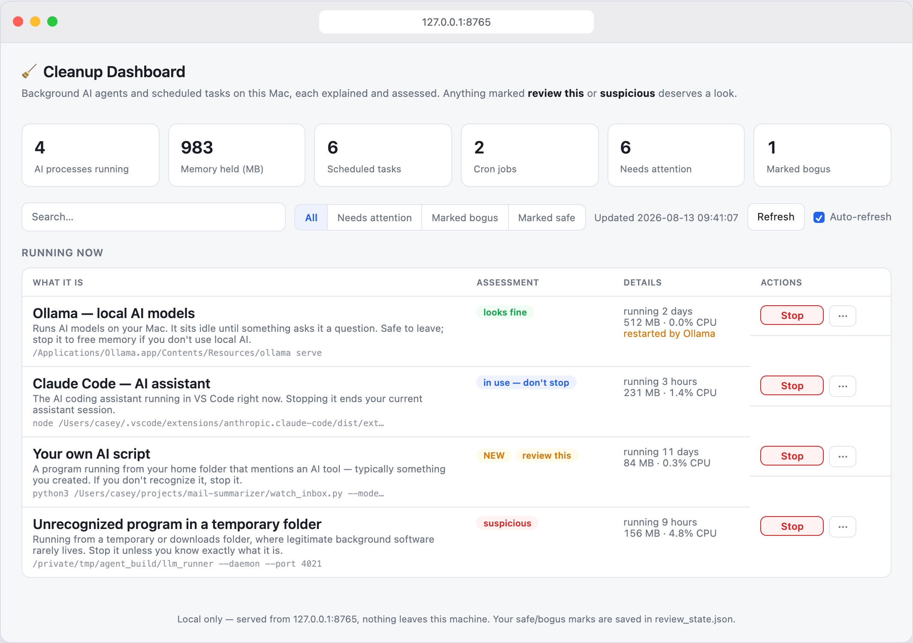
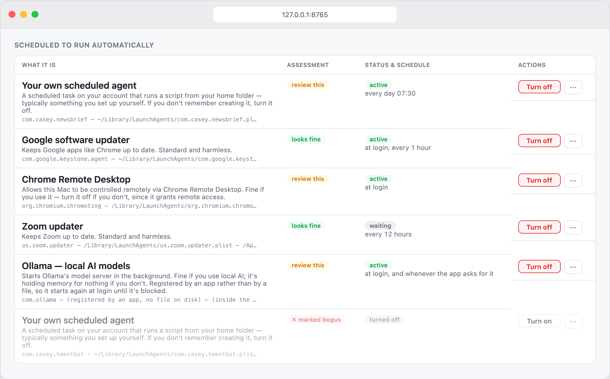
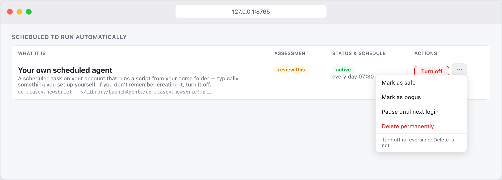
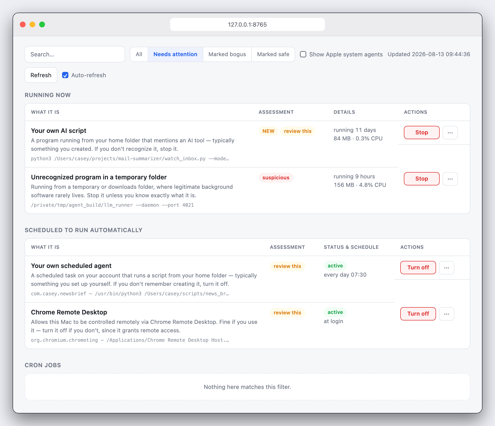
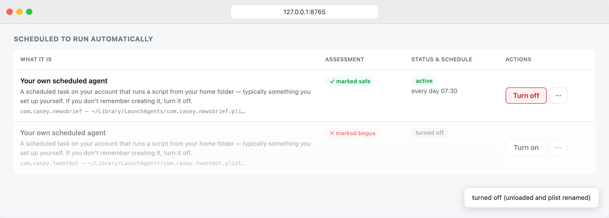
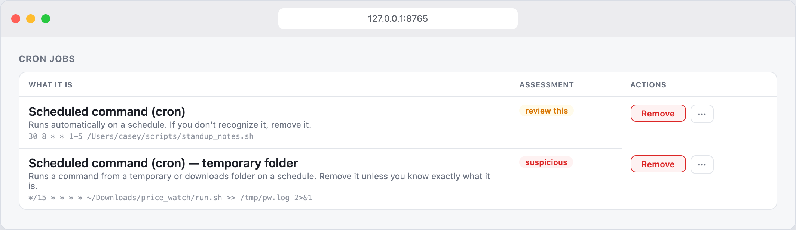
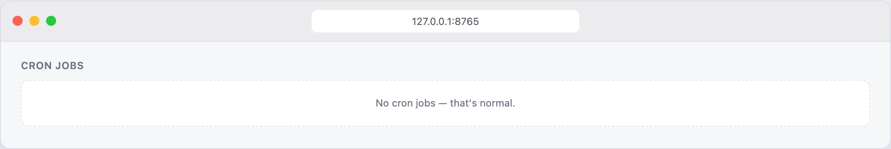
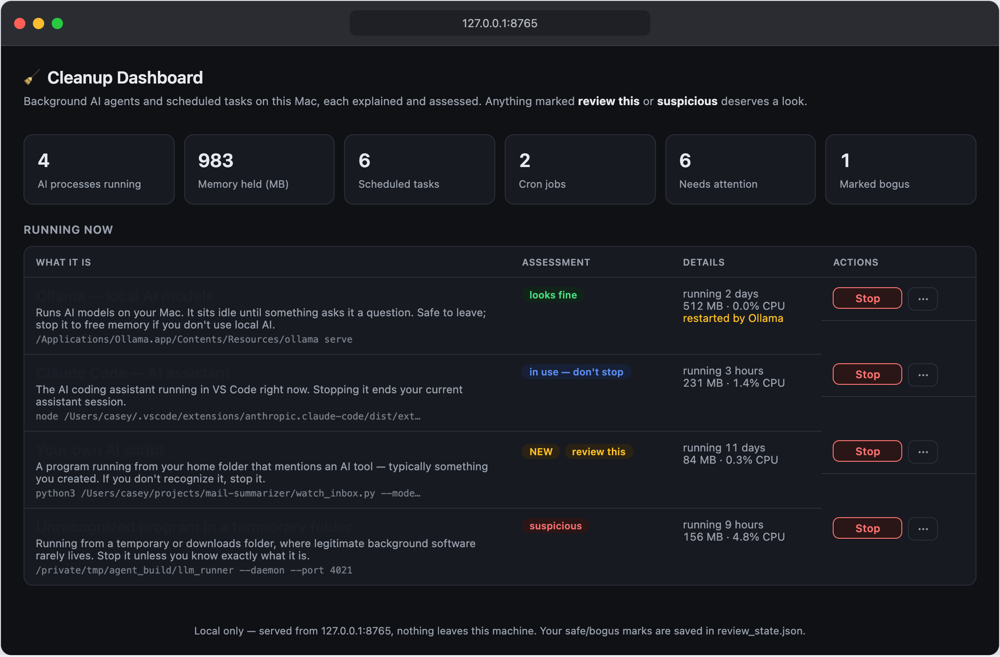
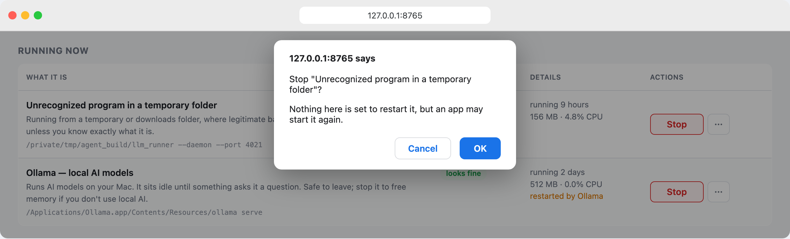

# Cleanup Dashboard

A local web page that lists the AI agents and background jobs running on your
Mac, tells you what each one actually is, and lets you switch off the ones you
don't want.



> Every screenshot here uses made-up data. None of it came off a real machine.

## Why I built it

I set up a small agent one evening to watch rental listings for a new home,
put it on a schedule, and then stopped thinking about it. It woke up at 8:00
and 16:00 on weekdays, and again every time the Mac booted. It never asked for
anything or showed a window, so there was nothing to remind me it existed —
not even after I'd found a place and stopped looking. I only found it again
because I asked an AI assistant to go through my background processes and tell
me what was there.

Turning it off took two commands. Finding it was the hard part.

Macs are good at running things forever without mentioning it. Some of that is
your own doing (launchd agents you set up once, a local model runtime that
starts at login), and some of it arrived with software you installed for other
reasons: updaters, sync helpers, remote-access tools. Activity Monitor will
show you all of it and explain none of it. The parts that would actually
answer your questions are in `launchctl`, plist files and crontabs, which is
not somewhere most people are going to go poking.

So I wrote the thing I wanted that night.

## What it does

One page, three lists:

- processes running now that look like AI agents or agent backends
- every LaunchAgent in `~/Library` and `/Library`, including ones already
  switched off (macOS keeps its own in `/System` and `/Library/Apple`,
  neither of which is touched)
- background items apps register through SMAppService, which have no file
  anywhere in those folders because they live inside the app bundle. These
  are what System Settings calls "Allow in the Background", and they're
  usually the reason something you stopped is running again tomorrow
- cron jobs



The point isn't the list, though. Activity Monitor already gives you a list.
The point is that each row tells you what the thing is in words you can act on:
*"Google software updater. Keeps Google apps like Chrome up to date. Standard
and harmless."* Or, less comfortably: *"Chrome Remote Desktop. Allows this Mac
to be controlled remotely. Fine if you use it, turn it off if you don't."*

Each item also gets a verdict:

| Badge | What it means |
|---|---|
| in use, don't stop | Something you're actively relying on right now |
| looks fine | Recognised software with a known purpose |
| review this | Your own scripts, unknown tasks, anything granting remote access |
| suspicious | Unrecognised *and* running out of a temp or downloads folder |

Anything the dashboard hasn't seen before is flagged NEW for a week, which is
the case that started all this: a new agent you don't remember creating should
be hard to miss.

Rows have one button. Stop for a process, Turn off (or Turn on) for a
scheduled agent, Remove for a cron line. The rest lives behind the ⋯ menu,
because force-killing something and deleting it forever shouldn't be as easy
to click as the safe option.



You can also overrule the dashboard. Mark as safe or Mark as bogus sticks to
that item and replaces the automatic badge next time you look.

## How it compares

Tools that list this stuff already exist, and it's worth being clear about
what they do. KnockKnock (Objective-See, free) enumerates more persistence
locations than this does and checks every binary against VirusTotal; it's the
right tool for "is this malware?". macOS itself, since Ventura, notifies you
when software adds a background item and lists them in System Settings,
though often as a bare developer name with an on/off switch and nothing else.
EtreCheck writes a diagnostic report you can hand to someone who knows Macs.
LaunchControl gives launchd experts full control over every job.

What none of them answer is the question this tool is for: what is this
thing, when does it run, and will anything break if I turn it off. No
schedule in words, no plain-language identity, no first-seen tracking, no
cron in the same view. If you suspect malware, run KnockKnock. If you suspect
your own past self, run this.

## Install

You need macOS and Python 3. If `python3 --version` prints something, you're
fine. There's nothing to install beyond that; it's standard library only.

```bash
git clone https://github.com/neerajmg/cleanup-dashboard.git
cd cleanup-dashboard
python3 server.py
```

That serves http://127.0.0.1:8765 and opens it. Ctrl-C stops it. The printed
URL carries a one-session token; a tab opened without it shows a locked page,
so get back in through that URL or the app rather than typing the address by
hand.

If you'd rather not use the terminal every time:

```bash
./build_app.sh
```

That builds `Cleanup Dashboard.app` into /Applications (or ~/Applications if
the first isn't writable). Open it like any app, use the dashboard, then quit
it from the Dock when you're done, which shuts the server down too. It's an
AppleScript applet with the project path compiled into it, so run
`build_app.sh` again whenever you move the folder or pull an update; an app
built from older code opens the dashboard without the session token and gets
the locked page.

## Using it

Click the "Needs attention" filter first. That hides everything already
recognised or already marked and leaves you with the handful worth thinking
about. Work down the list: if you know what something is and want it, mark it
safe and it stops bothering you. If you don't recognise it, read the
explanation and turn it off. Turning a scheduled agent off is reversible, so
you can be fairly relaxed about it.



<details>
<summary>More screenshots</summary>

Your own verdicts override the automatic ones, and actions report back:



Cron jobs are treated the same way:



Empty sections say so rather than disappearing:



It follows your system appearance:



</details>

## How it works

There isn't much to it. `server.py` is a single file using
`http.server`, and `static/index.html` is one page of plain HTML with no build
step and no dependencies. The port (8765) is a constant at the top of
`server.py` if you need to change it.

Scanning is `ps` output run through keyword and path rules. Anything living
under `/System`, `/usr/libexec` and friends is dropped, as are Electron
renderer and GPU helpers, since killing those just crashes the parent app.
What's left gets matched against names like ollama, claude, codex and copilot.
LaunchAgent plists are read with `plistlib` rather than grepped, and their
`RunAtLoad`, `StartInterval` and `StartCalendarInterval` keys are turned into
phrases like "at login; Mon-Fri 08:00, 16:00". `launchctl list` says which of
them are actually loaded.

The verdicts come from a lookup table of known vendors plus a few fallback
rules. A scheduled task running a script out of your home directory is
probably yours, so it gets flagged for review rather than assumed safe.
Something running from `/tmp` or Downloads gets called suspicious, because
real software almost never lives there. An agent carrying an Apple label is
flagged too: Apple's own live in `/System` and `/Library/Apple`, so one in
the folders this does scan is either installer residue or something using
the name to look official, and it's worth knowing which. No model is involved anywhere in this;
it's a table and some `if` statements, which is also why it runs instantly and
works offline.

Each item is fingerprinted by executable path, agent label or cron line, and
first/last seen timestamps go into `review_state.json` next to the server,
along with your safe/bogus marks. That file is gitignored because it describes
your machine.

Actions are the obvious ones. Stop is SIGTERM, force is SIGKILL. Turn off has
to do two things, because `launchctl bootout` on its own lasts only until you
next log in, which is the sort of half-fix that lets a forgotten agent come
back. For a plist you own (`~/Library/LaunchAgents`) it boots the agent out
and renames the file to `.disabled`. For one you don't (`/Library/LaunchAgents`,
put there by some installer) renaming needs sudo, so it writes a
`launchctl disable` override first and then boots the agent out: that order
means a failure partway leaves the thing off from next login rather than
fully live. Turn on undoes whichever mechanisms are in play, and only
restarts the agent if it was actually running when you turned it off.

One thing can undo an override without you: some installers run
`launchctl load -w` when the app updates itself, which clears it. If
something you switched off is running again after an update, that's why.

A plist with no `Label` and no program can't be a launchd job at all. Google's
uninstaller leaves files like that behind, so they're shown as empty leftovers
with no on/off switch rather than being handed to launchctl under a name
guessed from the filename.

Stopping a process is a different matter, and the dashboard tries not to
pretend otherwise. Almost nothing in the process list runs on its own: the
assistant backends are children of your editor, the model server is a child
of its app. Killing one of those frees the memory now, and the parent starts
it again whenever it likes. So each row traces its ancestry to whatever owns
it and says "restarted by Visual Studio Code" in the row, and the
confirmation repeats it. To stop something like that for good you turn off
the background item that starts the app's helper, or quit the app; the
dashboard can do the first and says so rather than implying a kill is final.

`build_app.sh` wraps all of it in an AppleScript applet: start the server if
it isn't already up, open the browser, and on quit kill whatever is listening
on port 8765. Listening specifically: a browser tab with the dashboard open
holds a connection on the same port, and an earlier version of the quit
handler would have killed the browser along with the server.

## Security

It's a web page with kill buttons on it, so:

The server only binds to 127.0.0.1, and it rejects any request whose Host or
Origin header isn't the dashboard itself. Without that second check a website
you happened to have open could POST to these endpoints in the background.

Browsers aren't the only thing that can reach a localhost port, though; every
program on the Mac can. So the server also generates a random token each time
it starts and refuses any API request that doesn't carry it. The token
reaches your browser only through the URL the server opens at launch, and is
never embedded in the served page, which any local process could download.
This is aimed at sandboxed apps, which can reach the port but not the token
file. A full-privilege process running as your user can read the token file,
but it can also call kill and launchctl directly, so the API gives it nothing
it didn't already have. An earlier version shipped without this check, and a
sandboxed app could have driven the kill endpoints through it.

Every destructive action re-scans before it does anything and refuses targets
that aren't in the fresh results. If a PID has been recycled, or a plist moved,
or the crontab changed since the page loaded, the request fails instead of
acting on the wrong thing.

Agents under `/Library` are never renamed or deleted; that needs `sudo` and
this tool doesn't ask for it. To turn one off it writes a `launchctl disable`
override, which macOS stores in
`/var/db/com.apple.xpc.launchd/disabled.<uid>.plist`, not in this project.
That is the one change the tool makes outside its own folder, it applies to
your account only, and Turn on reverses it. The confirmation dialog says so
before you click.

Anything that looks like emergency alerts, anti-malware, VPN, or device
management gets a second confirmation naming what it is, because a list of
background tasks doesn't make it obvious that the row you're about to switch
off is how your employer reaches this machine.

Command lines are escaped before they're rendered, on the assumption that a
process name is attacker-controlled text.



## What it won't do

It's macOS only, and it isn't a malware scanner. Detection is keyword and path
matching, so anything deliberately named to blend in will blend in. What it's
good at is the boring failure mode: software you forgot about, or never knew
was there.

The knowledge base is small and reflects whatever was installed on my machine
when I wrote it, so on your Mac more things will fall through to the generic
"review this" than I'd like. It's one table (`AGENT_KNOWLEDGE` in
[server.py](server.py)) and adding to it is easy, so that's the most useful
thing to send a PR for.

Some other rough edges worth knowing: shell wrappers show up as their own rows,
so a helper script can appear next to the thing it launched. Login items and
other auto-start mechanisms aren't scanned yet, only launchd and cron. And the
page polls every 15 seconds, which is fine on a laptop and would be silly on
anything else.

## Privacy

Nothing leaves the machine. No network calls, no analytics, no API keys, and
no way for the page to be reached from another device. Your scan history stays
in `review_state.json` in the project folder, and you can delete it whenever
you like; the dashboard just starts over.

## License

MIT, see [LICENSE](LICENSE).
